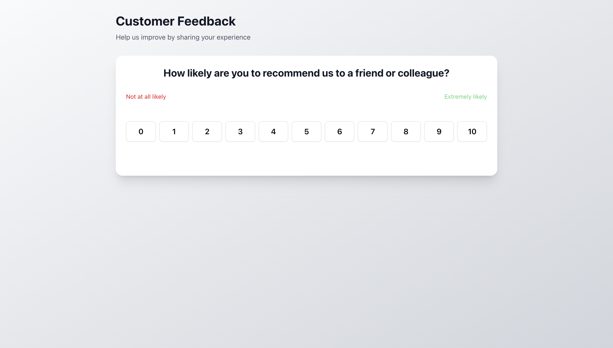
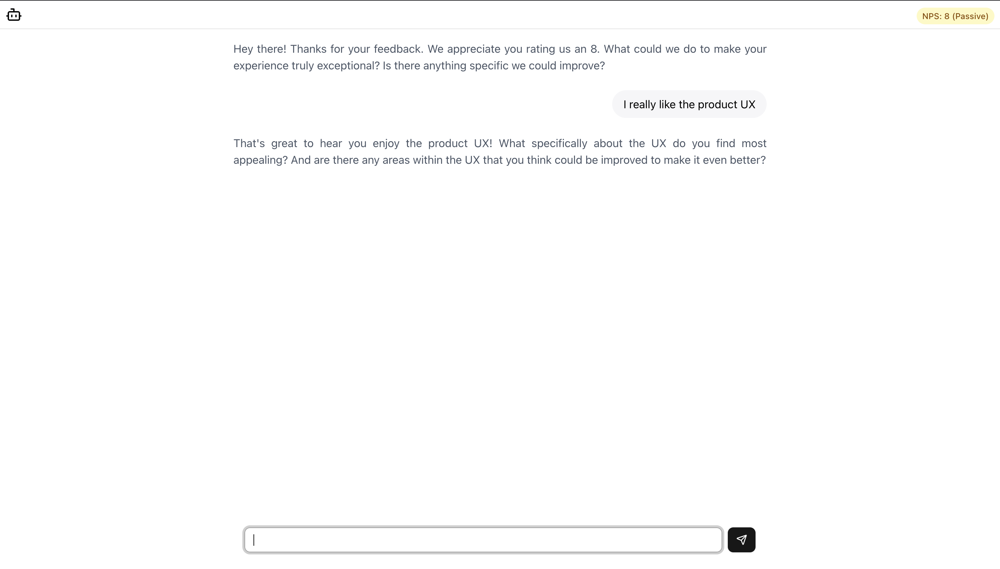

# Floto NPS – Customer Feedback Chat App

Floto NPS is a AI-powered customer feedback application built with [Next.js](https://nextjs.org). It collects Net Promoter Score (NPS) ratings and initiates a personalized, conversational follow-up with users, leveraging Google Gemini AI for empathetic, actionable insights.

 <!-- Add a screenshot if available -->

 <!-- Add a screenshot if available -->

---

## ✨ Features

- **NPS Collection:** Simple, attractive UI for users to rate their experience (0–10).
- **AI Chat Follow-up:** Automated, context-aware chat powered by Google Gemini, tailored to the user's NPS score.
- **Empathetic Responses:** Dynamic prompts for detractors, passives, and promoters.
- **Modern UI:** Responsive, accessible design using Tailwind CSS and Radix UI primitives.
- **TypeScript & Modular:** Fully typed, maintainable, and easy to extend.

---

## 🚀 Getting Started

First, install dependencies:

```bash
pnpm install
# or
npm install
# or
yarn install
```

Then, run the development server:

```bash
pnpm dev
# or
npm run dev
# or
yarn dev
```

Open [http://localhost:3000](http://localhost:3000) to view the app.

---

## 🛠️ Project Structure

```
src/
  app/                # Next.js app directory
    api/chat/         # API route for AI chat
    layout.tsx        # Root layout
    page.tsx          # Main page (NPS form & chat)
    globals.css       # Global styles
  components/         # UI and feature components
    nps-form.tsx      # NPS rating form
    chat.tsx          # Chat interface
    messages.tsx      # Chat message display
    chat-header.tsx   # Chat header with NPS badge
    ui/               # Reusable UI primitives (button, card, input, avatar)
  lib/
    prompts.ts        # AI prompt generation logic
    utils.ts          # Utility functions (score color, label, etc.)
```

---

## 🤖 How It Works

1. **User submits NPS score** via the form.
2. **AI chat starts**: The app sends the score to the backend ([`src/app/api/chat/route.ts`](src/app/api/chat/route.ts)), which generates a tailored prompt using [`lib/prompts.ts`](src/lib/prompts.ts).
3. **Google Gemini responds**: The AI engages the user in a follow-up conversation, adapting its tone and questions based on the NPS category.
4. **UI updates in real-time**: Messages are streamed and displayed in the chat interface.

---

## 🏗️ Built With

- [Next.js](https://nextjs.org)
- [Tailwind CSS](https://tailwindcss.com)
- [ShadCN](https://ui.shadcn.com/)
- [Google Gemini (AI)](https://ai.google.dev/)
- [TypeScript](https://www.typescriptlang.org/)
- [Vercel AI SDK](https://ai-sdk.dev/)
